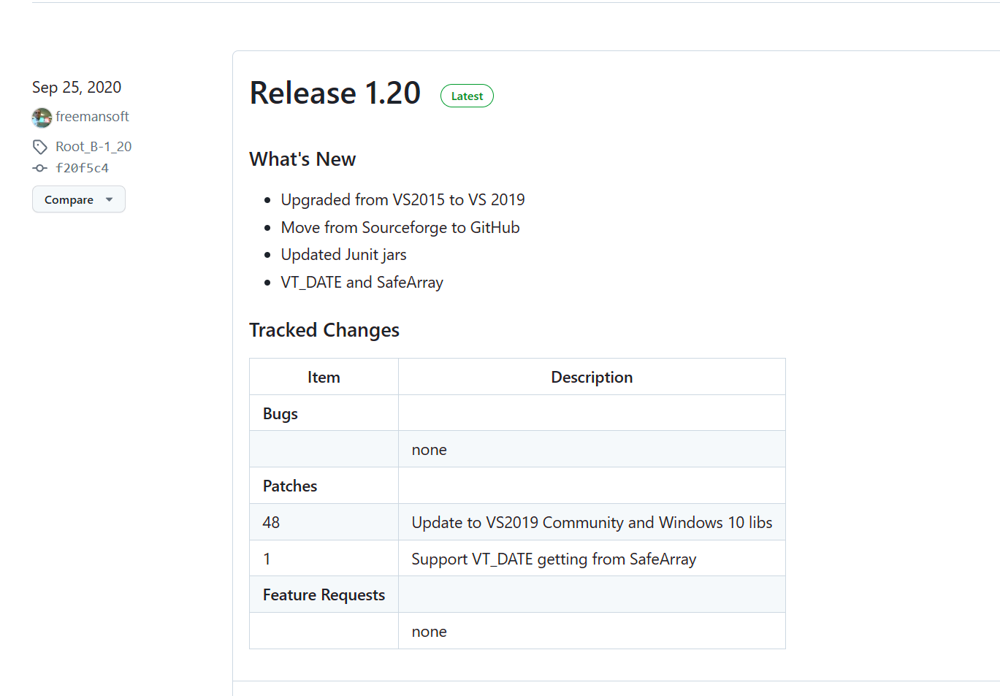
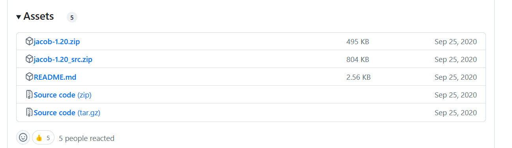
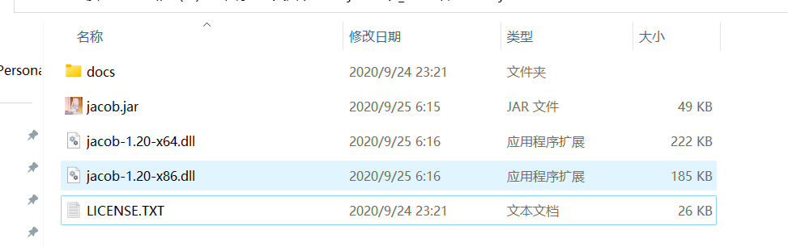
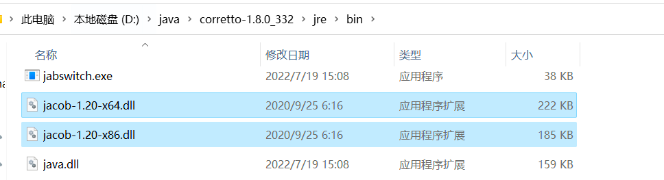
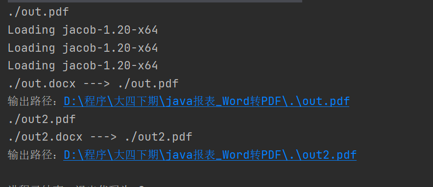
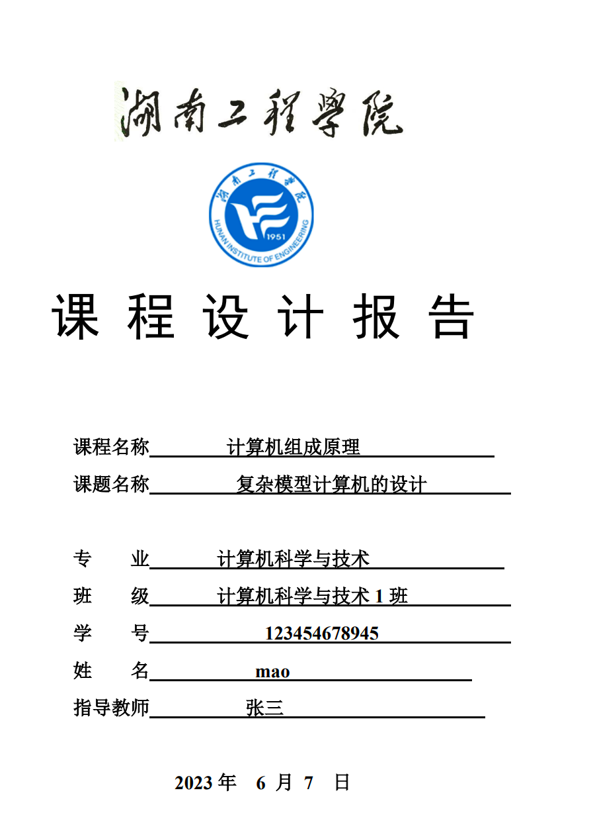
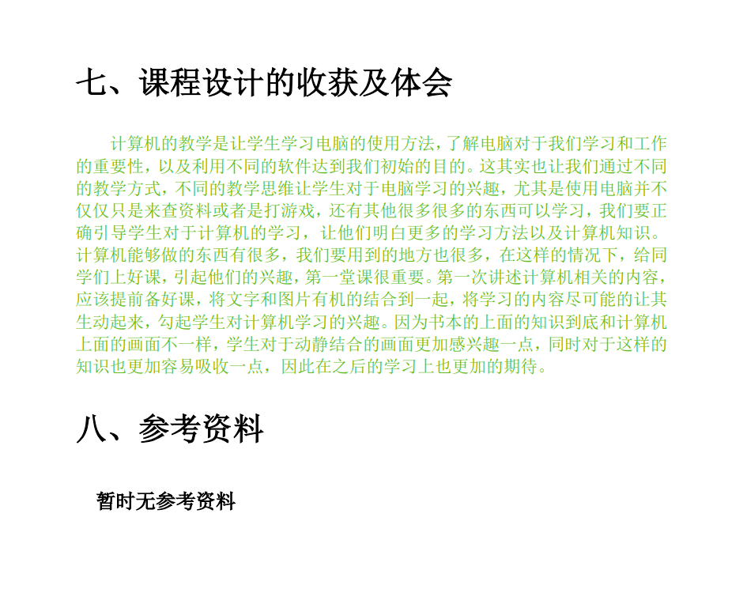
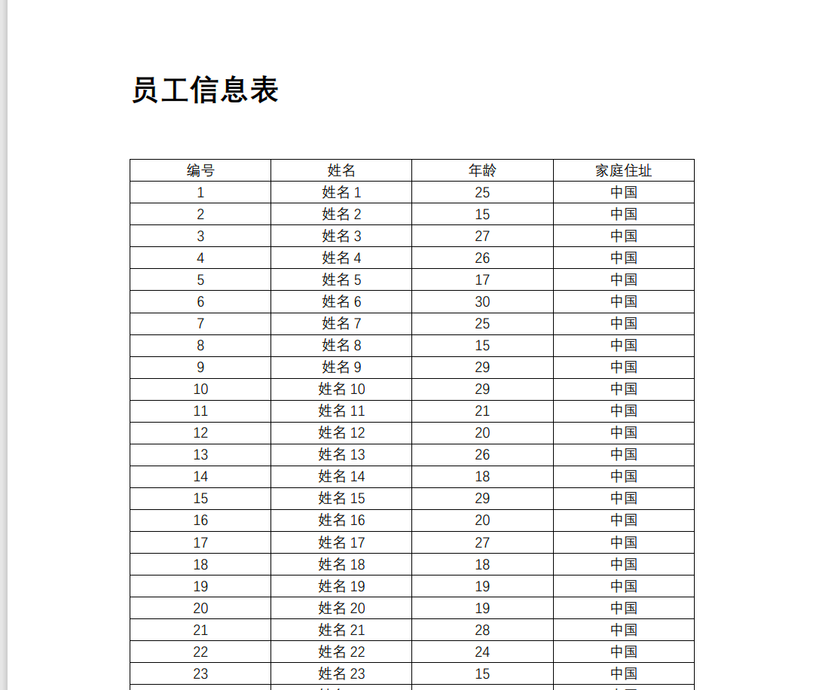
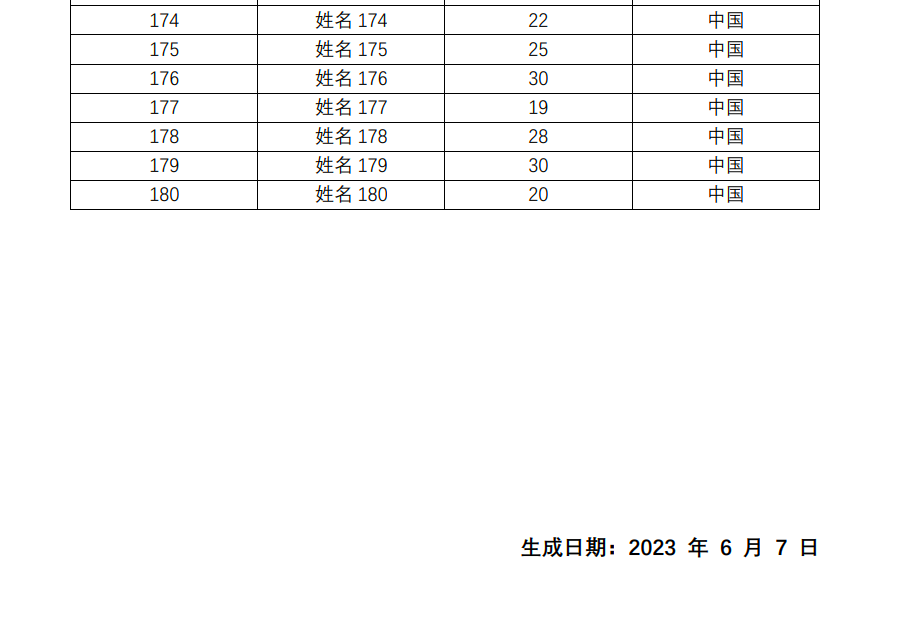
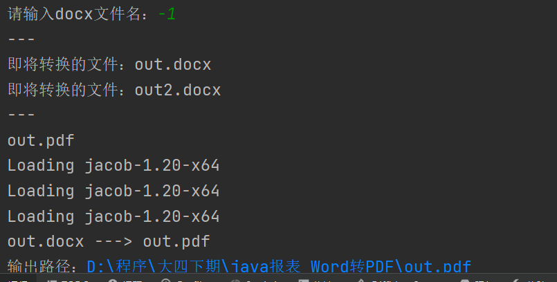

# PDF

## 概述

PDF（Portable Document Format的简称，意为“便携式文件格式”）是由Adobe Systems在1993年用于文件交换所发展出的文件格式。

PDF格式的文档的使用有如下好处：

* 跨平台：PDF文件格式与操作系统平台无关，也就是说，PDF文件不管是在Windows，Unix还是在苹果公司的Mac OS操作系统中都是通用的。不受平台的限制。越来越多的电子图书、产品说明、公司文告、网络资料、电子邮件开始使用PDF格式文件。
* 安全性高，不易修改：PDF是一种通用文件格式，不管创建源文档时使用的是哪些应用程序和平台，它均可以保留任何源文档的字体、图像、图形和版面设置。已成为世界上安全可靠地分发和交换电子文档及电子表单的实际标准
* 阅读性能高，阅读舒适性好
* 相比Word格式的文档，PDF文件格式更为正式：而WORD文档在跨平台使用方面不如PDF方便，而且WORD文档是可以进行编辑修改的，在安全性和可靠性上不如PDF，而且往往很难反映出用其它编辑软件排版的版面信息，使用上有一定的局限性


## Word转PDF

### 概述

把Word转成PDF目前最简单的方式就是调用office的方法，本质上就是打开Word后另存为成pdf

可以使用 **jacob**来实现，Word中的原样式也不会丢失。


### 环境准备

最基本的环境：

1. 本机上安装了2007以上的office软件  

2. dk1.6以上的版本


第一步：从github上下载资料

https://github.com/freemansoft/jacob-project/releases







或者直接下載：https://github.com/freemansoft/jacob-project/releases/download/Root_B-1_20/jacob-1.20.zip


下载解压后的目录结构如下：




```sh
PS D:\程序\大四下期\java报表_Word转PDF\jacob-1.20> ls


    目录: D:\程序\大四下期\java报表_Word转PDF\jacob-1.20


Mode                 LastWriteTime         Length Name
----                 -------------         ------ ----
d-----         2020/9/24     23:21                docs
------         2020/9/25      6:16         226816 jacob-1.20-x64.dll
------         2020/9/25      6:16         189440 jacob-1.20-x86.dll
------         2020/9/25      6:15          49913 jacob.jar
------         2020/9/24     23:21          26440 LICENSE.TXT


PS D:\程序\大四下期\java报表_Word转PDF\jacob-1.20>
```


把下载的资料中的jar放入到本地仓库

这个jar从中央仓库中没有找到，需要我们自己打到本地仓库中

进入到jar所在的目录执行以下命令：

```sh
mvn install:install-file -DgroupId="com.jacob" -DartifactId="jacob" -Dversion=1.20 -Dfile=".\jacob.jar" -Dpackaging=jar
```


添加依赖：

```xml
<dependency>
    <groupId>com.jacob</groupId>
    <artifactId>jacob</artifactId>
    <version>1.20</version>
</dependency>
```


或者下载源码，然后将源码拷贝到项目里：

https://github.com/freemansoft/jacob-project/releases/download/Root_B-1_20/jacob-1.20_src.zip


将动态链接库放入jre的bin目录，放项目根目录也可以：




### 实现

使用之前生成的两个docx文件测试

```java
package mao;

import com.jacob.activeX.ActiveXComponent;
import com.jacob.com.Dispatch;

import java.awt.*;
import java.io.File;

/**
 * Project name(项目名称)：java报表_Word转PDF
 * Package(包名): mao
 * Class(类名): Test1
 * Author(作者）: mao
 * Author QQ：1296193245
 * GitHub：https://github.com/maomao124/
 * Date(创建日期)： 2023/6/7
 * Time(创建时间)： 17:47
 * Version(版本): 1.0
 * Description(描述)： 无
 */

public class Test1
{
    public static void main(String[] args)
    {
        docxToPdf("./out.docx");
        docxToPdf("./out2.docx");
    }


    /**
     * 将docx文件转换成pdf文件
     *
     * @param docxFileName docx文件名
     */
    public static void docxToPdf(String docxFileName, String pdfFileName)
    {
        if (docxFileName == null)
        {
            throw new IllegalArgumentException("请输入正确的文件名");
        }
        if (!docxFileName.endsWith(".docx"))
        {
            throw new IllegalArgumentException("文件的后缀名不正确");
        }
        if (pdfFileName == null)
        {
            pdfFileName = docxFileName.substring(0, docxFileName.length() - 4) + "pdf";
            System.out.println(pdfFileName);
        }
        else
        {
            if (!pdfFileName.endsWith(".pdf"))
            {
                throw new IllegalArgumentException("文件的后缀名不正确");
            }
        }

        //注意：这里调用了动态链接库，工作路径已经不是查询当前路径了，使用相对路径可能会出现找不到的问题
        ActiveXComponent app = null;
        try
        {
            //调用window中的程序
            app = new ActiveXComponent("Word.Application");
            //调用的时候不显示窗口
            app.setProperty("Visible", false);
            //获得所有打开的文档
            Dispatch docs = app.getProperty("Documents").toDispatch();
            Dispatch doc = Dispatch.call(docs, "Open", new File(docxFileName).getAbsolutePath()).toDispatch();
            System.out.println(docxFileName + " ---> " + pdfFileName);
            System.out.println("输出路径：" + new File(pdfFileName).getAbsolutePath());
            //另存为，将文档保存为pdf，其中Word保存为pdf的格式宏的值是17
            Dispatch.call(doc, "SaveAs", new File(pdfFileName).getAbsolutePath(), 17);
            Dispatch.call(doc, "Close");
        }
        catch (Exception e)
        {
            Toolkit.getDefaultToolkit().beep();
            e.printStackTrace();
        }
        finally
        {
            //关闭office
            if (app != null)
            {
                app.invoke("Quit", 0);
            }
        }
    }

    /**
     * 将docx文件转换成pdf文件
     *
     * @param docxFileName docx文件名
     */
    public static void docxToPdf(String docxFileName)
    {
        docxToPdf(docxFileName, null);
    }
}
```
















控制台输入文件名或者转换当前路径下的所有docx文件

```java
package mao;

import java.io.File;
import java.util.ArrayList;
import java.util.List;
import java.util.Scanner;

/**
 * Project name(项目名称)：java报表_Word转PDF
 * Package(包名): mao
 * Class(类名): Test2
 * Author(作者）: mao
 * Author QQ：1296193245
 * GitHub：https://github.com/maomao124/
 * Date(创建日期)： 2023/6/7
 * Time(创建时间)： 20:56
 * Version(版本): 1.0
 * Description(描述)： 无
 */

public class Test2
{
    public static void main(String[] args)
    {
        System.out.println("提示：输入“-1”转换当前路径下的所有docx文件");
        System.out.print("请输入docx文件名：");
        Scanner input = new Scanner(System.in);
        String fileName = input.nextLine();
        if (!fileName.equals("-1"))
        {
            Test1.docxToPdf(fileName);
        }
        else
        {
            //转换当前路径下的所有docx文件
            List<String> fileList = new ArrayList<>();
            File[] files = new File("./").listFiles();
            if (files == null || files.length == 0)
            {
                return;
            }
            System.out.println("---");
            for (File file : files)
            {
                if (file.getName().endsWith(".docx"))
                {
                    System.out.println("即将转换的文件：" + file.getName());
                    fileList.add(file.getName());
                }
            }
            System.out.println("---");
            for (String docxFile : fileList)
            {
                Test1.docxToPdf(docxFile);
            }
        }
    }
}
```





